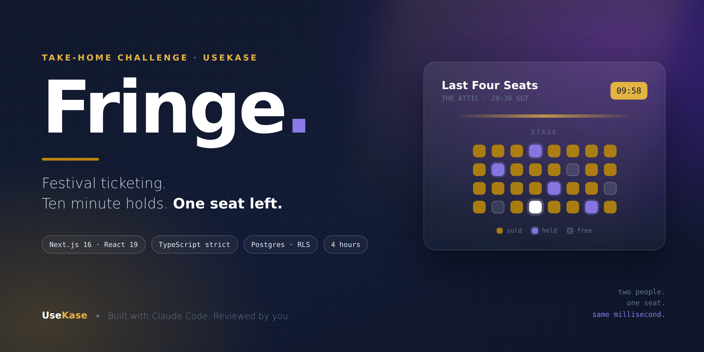

# UseKase Take-Home: Fringe — festival ticketing

Welcome, and thanks for the time you're putting into this.

**Fringe** is a small ticketing app for a fringe theatre festival. Dozens of tiny
venues, hundreds of shows, tickets held in a basket for ten minutes before
payment, and a hard rule that two people must never end up owning the same seat.

It is a deliberately fun problem with a genuinely nasty middle: inventory that
three people are grabbing at once, holds that expire, and money that has to add
up to the cent.

This is not our product and you won't be building anything like it on day one.
The stack is ours, though, and so are the habits we're looking for.

---

## Ground rules

**Time box: 4 hours.** Hard stop. The scope below is deliberately larger than
four hours. We are not testing whether you finish. We are testing what you build
first, what you cut, and whether the part you did build is genuinely good.
Cutting scope on purpose and saying why scores higher than five half-features.

**Claude Code is required.** This role is AI-assisted development day to day, so
we want to see how you work with the tool, not whether you can avoid it. Use it
as your primary assistant; Copilot, Cursor or anything else on top is fine. Ship
an `AI_USAGE.md` — it is a graded artifact, not an afterthought.

**Submission:** a GitHub repo with real commit history. Please don't squash four
hours into one commit. Include a `SOLUTION.md` covering what you built, what you
cut, and what you'd do next.

---

## The domain

```
venue      a room. name, city, timezone, capacity
show       a performance at a venue. starts_at, base_price, status
ticket_tier full price, concession, under-26 - each a percentage of base price
hold       a basket. N tickets on a show, expires 10 minutes after creation
booking    a confirmed purchase. holds convert to bookings on payment
organiser  the person who runs a venue. owns their shows, sees their bookings
```

Seed schema and data are in `db/`. Read them before you write anything — they
are a starting point, not a finished design, and at least one thing in there is
wrong.

### The rules that matter

1. **A show can never be oversold.** Confirmed bookings plus live holds must
   never exceed capacity. Not "usually". Never — including when two people
   confirm the last two tickets at the same instant. Enforce this where it can't
   be raced around.
2. **Holds expire after 10 minutes** and their tickets return to the pool. An
   expired hold that nobody has swept up must not still be blocking inventory.
3. **A sold-out show and a temporarily-unavailable show are different things.**
   Capacity gone versus everything held by other people's baskets. Decide how you
   present each; a customer refreshing at the wrong second shouldn't be told a
   show is sold out when a basket is about to expire.
4. **Money is integer minor units.** Booking fee is 6% of the order, capped at
   $9.00, and the total on the confirmation must equal the sum of the lines. Work
   out where you round, and prove it.
5. **Times are shown in the venue's local timezone**, not the browser's. Two of
   the seeded venues are not in Singapore, and one of them observes daylight
   saving. This will bite you.

---

## Requirements

### Must have

- [ ] Browse shows: 10 per page, paginated, with a total count
- [ ] Filter by city and by availability; sort by start time
- [ ] Each card shows title, venue, local start time, price from, and how many
      tickets are left
- [ ] Loading, error and empty states. All three, visibly, all distinct
- [ ] Place a hold on N tickets, see the countdown, confirm it into a booking,
      or let it expire and watch inventory come back
- [ ] Organiser view: create and edit your own shows, see your own bookings
- [ ] An organiser must not be able to read or modify another organiser's shows
      or bookings, **even if an API route forgets to filter.** Enforce it in the
      database.
- [ ] Tests. Not coverage theatre: tests that pin down oversell, hold expiry, and
      the fee arithmetic.

### One typed tool

The festival wants a concierge bot that answers "what's on tonight under $30 near
Bugis?". You don't need to build a chat UI — just the tool it would call.

Expose `find_available_shows` with a Zod-validated input
(`{ city?: string, onDate?: string, maxPriceMinor?: number, minSeats?: number }`)
and a typed output. It must return only genuinely bookable shows, using the same
availability logic as the UI rather than a second copy of it.

A plain unit test calling the function directly is enough. No LLM, no API key.

### Nice to have (only if the core is genuinely done)

- Optimistic UI on hold creation, with a real rollback path
- A committed Claude Code command your reviewer could run
- Waitlist when a show is full
- Deploy it somewhere

---

## Tech requirements

Mirror our stack. Part of what we're assessing is how you handle an opinionated
codebase you didn't choose.

- **Next.js 16** (App Router), **React 19**
- **TypeScript, strict.** No `any`, no `@ts-ignore` without a comment explaining
  the trade-off
- **Tailwind v4**
- **Postgres via Supabase**, with row-level security. Local Supabase is fine
  (`supabase start`); any Postgres 15+ works too, as long as RLS is real
- **Vitest** for unit tests. Playwright optional
- **ESLint + Prettier**, committed config, passing
- CI: `npm run verify` must pass — lint, typecheck, test, and
  `scripts/integrity-guard.ts`, which fails the build if the schema can't
  actually hold the line on oversell, timezones or row-level security. It is
  already wired into `.github/workflows/ci.yml`. Don't delete it to go green.

---

## AI_USAGE.md — required

Copy `AI_USAGE.template.md` and fill it in as you go, not from memory at the end.
We're looking for judgment, not enthusiasm.

1. **How you set the tool up.** `CLAUDE.md`, plan mode, commands, permissions,
   subagents. Show us the actual files.
2. **Two or three prompts that mattered**, verbatim. Not your most polished one —
   the ones that changed the shape of the work.
3. **One place Claude Code was confidently wrong**, what the failure was, how you
   caught it, what you changed. This is the most important section. Concurrency
   and timezone code is exactly where a fluent wrong answer looks right, and
   everybody hits one. "It was great throughout" reads as "I didn't check."
4. **What you rejected**, and why.
5. **What you wrote yourself**, and why that part wasn't worth delegating.

No penalty for heavy use of the tool. Heavy penalty for code in your repo you
can't explain.

---

## How we assess

In rough order of weight:

1. **Design and decisions.** Where logic lives, how you modelled inventory, what
   you cut and why.
2. **Correctness under pressure.** Oversell, expiry, rounding, timezones. This is
   the heart of the exercise.
3. **Tests that mean something**, especially the concurrent path.
4. **AI_USAGE.md.** How you drive the tool and how you check it.
5. **Clean, readable code.** Naming, structure, small honest commits.
6. Working result and visual polish. Yes, last — though this one is a festival
   app, so have some fun with it.

## The follow-up

If we move forward, there's a 45-minute call. We'll open your repo, pick a file
neither of us has discussed, and talk through it. Then we'll ask you to make one
small change live, with Claude Code, sharing your screen.

Nothing to prepare for that. Same work, just watched.

Any questions, email careers@usekase.ai. Good luck.
